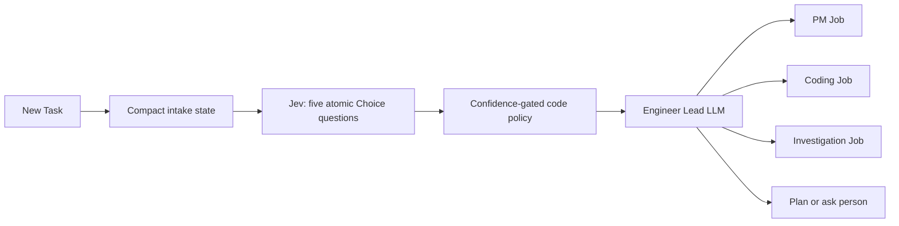

# Engineer lead routing

The first handoff on a software Task uses a hybrid router. TypeSafe Jev makes
fast typed judgments; deterministic code combines them conservatively; the
Engineer Lead LLM remains the authority that creates the actual Job.



## What Jev decides

One request evaluates five independent questions against the same compact
state:

1. likely first route: PM, coding, investigation, or lead deliberation;
2. whether product definition is ready, missing, or not applicable;
3. whether acceptance is clear, partial, or unsettled;
4. whether technical uncertainty is low, material, or high;
5. whether scope is local, cross-cutting, multiple outcomes, or unknown.

These are fast, closed-set judgments. Jev does not read the whole ledger, write
instructions, design an implementation, or create a Job.

## What code decides

`src/domain/lead-routing/policy.ts` combines the typed answers. Direct coding
requires every relevant signal to clear its threshold: coding route, product
readiness, clear acceptance, non-high technical uncertainty, and local scope.
Missing product definition routes to PM. A clear outcome with a high-confidence
investigation route starts with discovery. All low-confidence, contradictory,
cross-cutting, and otherwise unmatched cases fall back to lead deliberation.

Requests containing CJK text use stricter confidence gates because the current
Jev model documentation warns that CJK accuracy is lower. Thresholds are policy,
not model prompts, and should be calibrated against Conductor's own labeled
routing examples before they are loosened.

## What the LLM decides

The lead receives the recommendation and all five typed judgments in its first
wake prompt. It checks them against the request and repository context, resolves
contradictions, and owns the durable decision. It must use generative/System Two
reasoning for:

- writing a self-contained PM, coding, or investigation Job;
- architecture and dependency planning;
- interpreting a PM spec or worker return;
- deciding whether medium/large work needs a prototype and what it should prove;
- reconciling implementation discoveries, review findings, and CI evidence;
- phrasing a question or delivery report for the person.

If `TYPESAFE_API_KEY` is absent, Jev times out, or its response is invalid,
Conductor fails open to the existing Engineer Lead LLM. Jev is used only before
the first coordinator decision; later wakes are evidence reconciliation rather
than classification.

Configuration:

```json
{
  "leadRouting": { "enabled": true, "model": "jev-latest" }
}
```

The API key is supplied through Rome's app-key facility or the deployment
environment and is never stored in Conductor's configuration or database.
